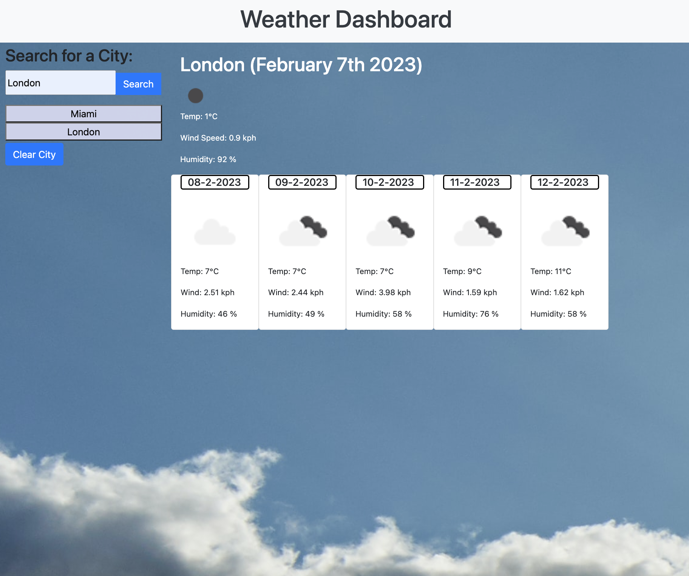

# weather-dashboard

## A weather app where you can view the forecast for the cities of your choosing.

This project is a weather app for selected cities, complete with today's forecast (current time), followed by a five-day projection (at 12:00).

## Installation

N/A

## Usage

Wesbite link: https://henryjamesgreen.github.io/weather-dashboard/

To find the forecast and current weather for a city of your choosing, just type the city in the search bar, click the 'search' button and the data will present itself. The data will also save on your return. If you'd like to clear the application, simply click 'clear city history'.

## Credits

- https://openweathermap.org/weather-conditions#Icon-list
- https://www.freecodecamp.org/news/git-push-local-branch-to-remote-how-to-publish-a-new-branch-in-git/
- https://stackoverflow.com/questions/8495687/split-array-into-chunks
- https://stackoverflow.com/questions/65434987/js-localstorage-for-cycle-includes-empty-string
- https://stackoverflow.com/questions/57099425/assign-an-id-to-a-button-generated-by-loop
- https://www.w3schools.com/js/js_json_stringify.asp#:~:text=Stringify%20a%20JavaScript%20Object&text=Use%20the%20JavaScript%20function%20JSON,string%20following%20the%20JSON%20notation.
- https://developer.mozilla.org/en-US/docs/Web/JavaScript/Reference/Operators/typeof
- https://www.tutorialspoint.com/retrieve-element-from-local-storage-in-javascript#:~:text=To%20get%20an%20element%20from,value%20for%20Local%20storage%20item.
- https://www.w3schools.com/jsref/met_storage_getitem.asp
- https://stackoverflow.com/questions/38533771/jquery-deferred-exception-cannot-read-property
- https://stackoverflow.com/questions/71575457/error-typeerror-cannot-read-properties-of-undefined-reading-phones
- https://developer.mozilla.org/en-US/docs/Web/JavaScript/Equality_comparisons_and_sameness

## License

Please refer to the licence in the repo.
